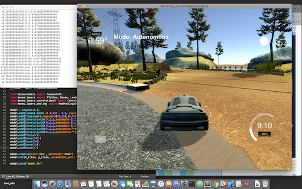
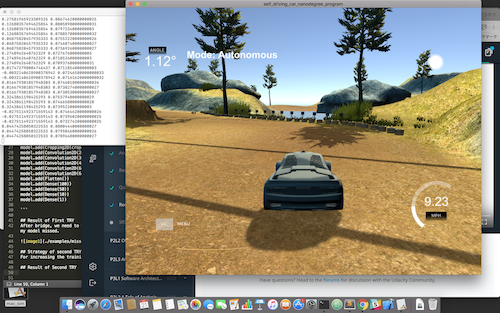
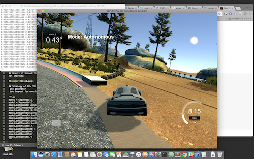
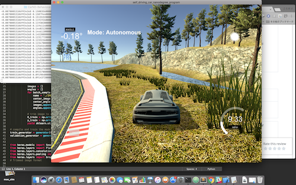
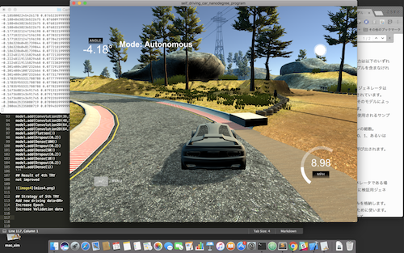

##CARND-TERM1 Project3

**Behavioral Cloning Project**

The goals / steps of this project are the following:
* Use the simulator to collect data of good driving behavior
* Build, a convolution neural network in Keras that predicts steering angles from images
* Train and validate the model with a training and validation set
* Test that the model successfully drives around track one without leaving the road
* Summarize the results with a written report

## Project files

My project includes the following files:<BR>
model.py containing the script to create and train the model<BR>
drive.py for driving the car in autonomous mode<BR>
model.h5 containing a trained convolution neural network <BR>
report.md summarizing the results<BR>

## Strategy of First TRY

The followings is my model architecture of First TRY. My model consists of a convolution neural nertwork. The model inculudes RELU layers.

```sh
model = Sequential()
model.add(Lambda(lambda x: x/255 - 0.5, input_shape=(160, 320, 3)))
model.add(Cropping2D(cropping=((70,25),(0,0))))
model.add(Convolution2D(24,5,5,subsample=(2,2),activation="relu"))
model.add(Convolution2D(36,5,5,subsample=(2,2),activation="relu"))
model.add(Convolution2D(48,5,5,subsample=(2,2),activation="relu"))
model.add(Convolution2D(64,3,3,activation="relu"))
model.add(Convolution2D(64,3,3,activation="relu"))
model.add(Flatten())
model.add(Dense(100))
model.add(Dense(50))
model.add(Dense(10))
model.add(Dense(1))

```

## Result of First TRY
After bridge, we need to turn left without lane lines. In this corner, my model missed.



## Strategy of second TRY
For increasing the training data, we use side camera datas.

## Result of Second TRY
not improved.



## Strategy of 3th TRY
 Use generator<BR>
 Use Dropout for overfitting

```sh
model = Sequential()
model = Sequential()
model.add(Lambda(lambda x: x/255 - 0.5, input_shape=(160, 320, 3)))
model.add(Cropping2D(cropping=((70,25),(0,0))))
model.add(Dropout(0.2))
model.add(Convolution2D(24,5,5,subsample=(2,2),activation="relu"))
model.add(Convolution2D(36,5,5,subsample=(2,2),activation="relu"))
model.add(Convolution2D(48,5,5,subsample=(2,2),activation="relu"))
model.add(Convolution2D(64,3,3,activation="relu"))
model.add(Convolution2D(64,3,3,activation="relu"))
model.add(Flatten())
model.add(Dense(100))
model.add(Dense(50))
model.add(Dense(10))
model.add(Dense(1))
```

## Result of 3th TRY

not improved



## Strategy of 4th TRY
Use new data of steady driving
Use Dropout at Dense layers<BR>

```sh
model = Sequential()
model = Sequential()
model.add(Lambda(lambda x: x/255 - 0.5, input_shape=(160, 320, 3)))
model.add(Cropping2D(cropping=((70,25),(0,0))))
model.add(Dropout(0.2))
model.add(Convolution2D(24,5,5,subsample=(2,2),activation="relu"))
model.add(Convolution2D(36,5,5,subsample=(2,2),activation="relu"))
model.add(Convolution2D(48,5,5,subsample=(2,2),activation="relu"))
model.add(Convolution2D(64,3,3,activation="relu"))
model.add(Convolution2D(64,3,3,activation="relu"))
model.add(Flatten())
model.add(Dropout(0.2))
model.add(Dense(100))
model.add(Dropout(0.2))
model.add(Dense(50))
model.add(Dropout(0.2))
model.add(Dense(10))
model.add(Dropout(0.2))
model.add(Dense(1))
```
## Result of 4th TRY
not improved



## Strategy of 5th TRY
Add new driving data<BR>
Increase Epoch
Increase Validation data

## Result of 5th TRY
 improved. <BR>
 But my car was out of line next corner.

 

## Strategy of 6th TRY
Increase Epoch
